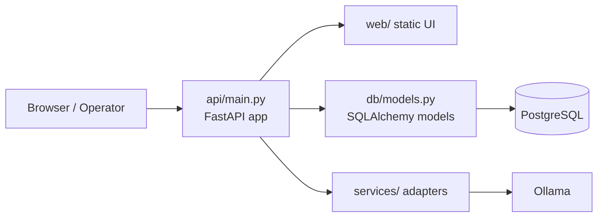
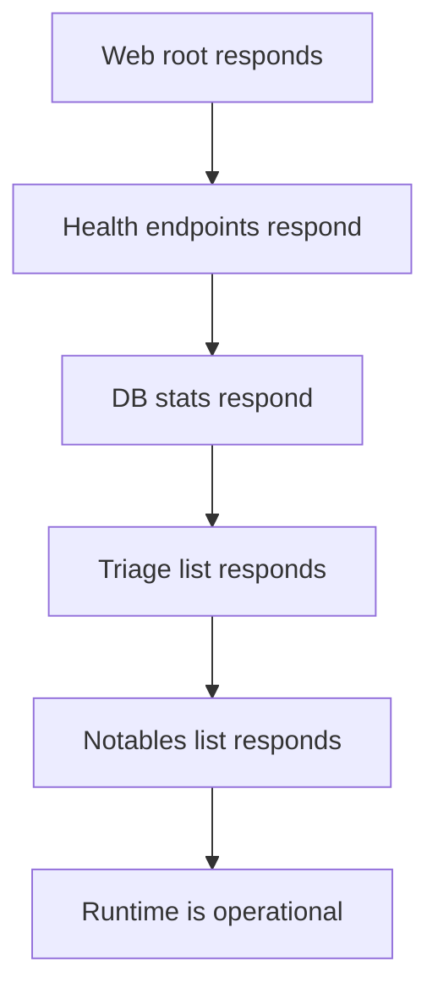

# API And Database Visual Map

This file explains the API and database mental model.

Use it when you need to answer:

- What part serves the browser?
- What routes matter most during validation?
- How does the API talk to the database?
- Where do notables and triage data show up?

## Runtime Shape



## Important Validation Routes

These are the routes that matter most in normal operations.

```mermaid
flowchart TD
    A[/health] --> B[Basic API liveness]
    C[/api/health] --> D[Compatibility health]
    E[/api/db/stats] --> F[DB summary counts]
    G[/api/db/triage] --> H[Triage list]
    I[/api/db/notables] --> J[Recent pasted notables]
    K[/] --> L[Web UI root]
```

## Data Flow: Triage And Notables

```mermaid
flowchart TD
    A[Pasted notable text] --> B[/api/db/notables/paste]
    B --> C[Sanitize / parse]
    C --> D[Store as SplunkEvent]
    D --> E[/api/db/notables]
    E --> F[Optional promote]
    F --> G[TriageResult rows]
    G --> H[/api/db/triage]
    H --> I[/api/db/triage/{case_id}]
```

## Smoke Test Mental Model

If you want to know whether the live stack is really usable, the smoke test checks this path:



## File Location Map

- API entry point: `api\main.py`
- DB models: `db\`
- UI files: `web\`
- service integrations: `services\`
- compose runtime definition: `docker-compose.yml`
- troubleshooting and smoke test driver: `scripts\troubleshoot_platform.ps1`