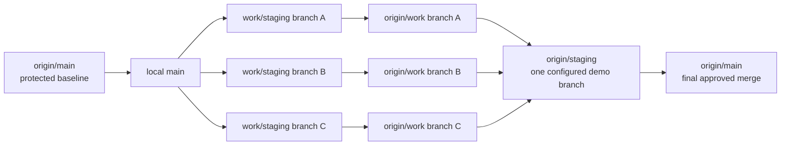
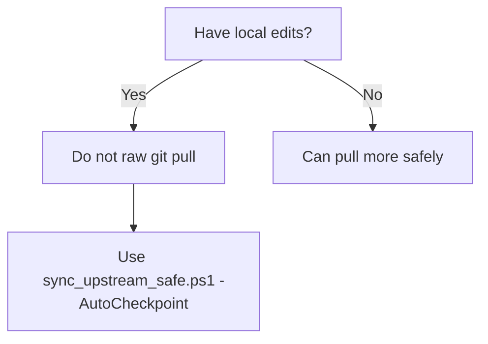
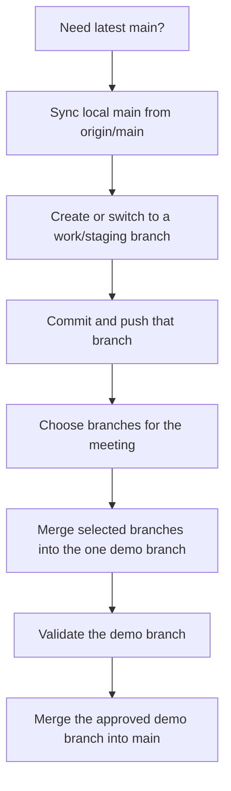
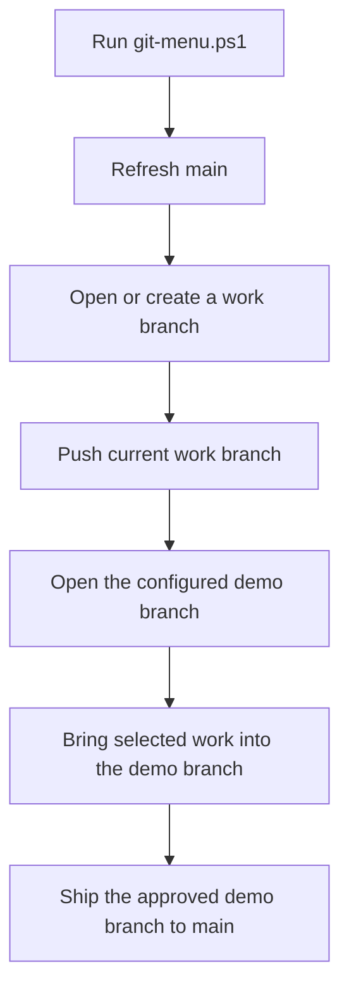

# Git Visual Map

This file explains the Git mental model for this repo.

Use it when you need to answer:

- When do I pull?
- When do I wait?
- Why should I avoid raw `git pull`?
- When should I commit and push?

## Core Mental Model

There are four Git roles that matter here:

1. `main`
    The protected baseline. Do not do normal coding here.
2. work/staging branches
    These are the branches where people actively code.
3. `staging`
    The one configured demo branch used to combine selected work for the meeting.
4. `main promotion`
    The explicit final step after the demo branch is validated.

## Why Raw Pull Is Risky Here

This repo often has:

- local uncommitted edits
- coworker pushes landing on `origin/main`
- runtime and docs changes mixed together

So the correct mental model is:

## Safe Team Sync Flow

## Menu Flow

## Decision Rules

- Do not do normal coding on `main`.
- If you have local edits, do not raw `git pull`.
- If you need the latest shared code, use `scripts\sync_upstream_safe.ps1 -AutoCheckpoint`.
- If you are doing active work, do it on a work/staging branch, not on `main`.
- Only use the one configured demo branch to combine selected work for the meeting.
- Only update `main` through the approved demo branch.
- If a merge conflict happens, resolve only the direct overlap, then revalidate.

## Script Entry Points

- safe sync: `scripts\sync_upstream_safe.ps1 -AutoCheckpoint`
- validate local state: `scripts\troubleshoot_platform.ps1`
- validate live stack: `scripts\troubleshoot_platform.ps1 -RunSmokeTest`
- branch-aware workflow menu: `git-menu.ps1`
- commit, push, or merge a target branch: `git-sync.ps1`