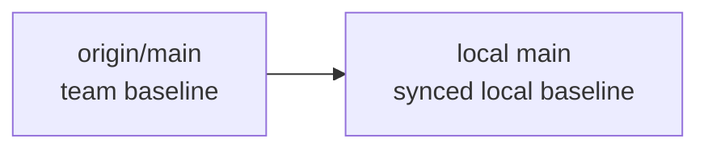
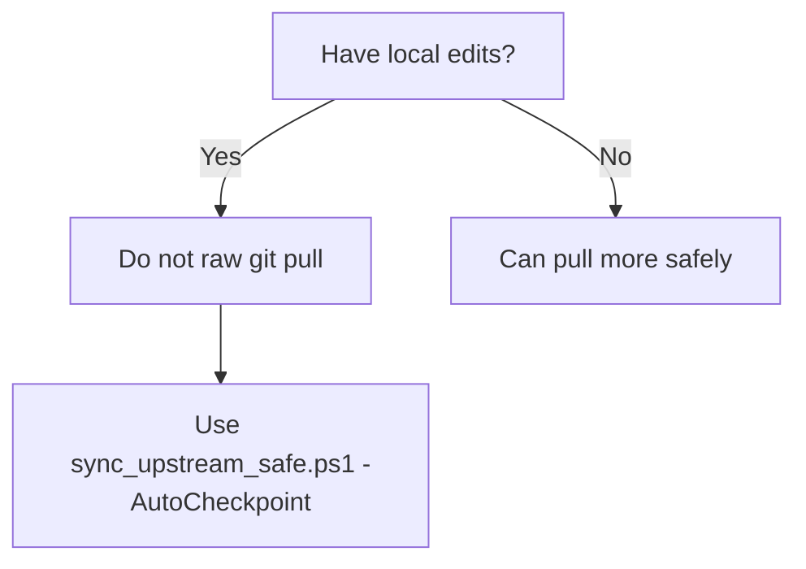
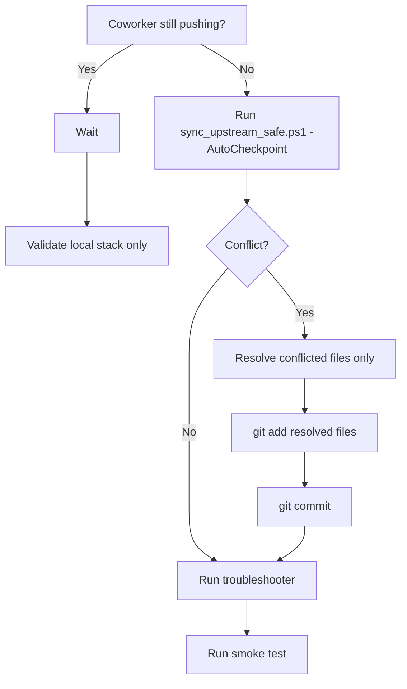
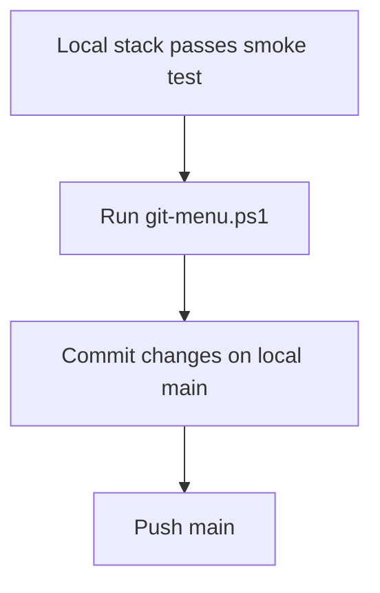

# Git Visual Map

This file explains the Git mental model for this repo.

Use it when you need to answer:

- When do I pull?
- When do I wait?
- Why should I avoid raw `git pull`?
- When should I commit and push?

## Core Mental Model

There are two Git states that matter most here:

1. `origin/main`
   The shared team baseline.
2. local `main`
   Your synced local baseline.

## Why Raw Pull Is Risky Here

This repo often has:

- local uncommitted edits
- coworker pushes landing on `origin/main`
- runtime and docs changes mixed together

So the correct mental model is:

## Safe Team Sync Flow

## Push Flow

## Decision Rules

- If a coworker is still pushing to `origin/main`, wait.
- If you have local edits, do not raw `git pull`.
- If you need the latest shared code, use `scripts\sync_upstream_safe.ps1 -AutoCheckpoint`.
- If you want to share your validated work, use `git-menu.ps1` from `main`.
- If a merge conflict happens, resolve only the direct overlap, then revalidate.

## Script Entry Points

- safe sync: `scripts\sync_upstream_safe.ps1 -AutoCheckpoint`
- validate local state: `scripts\troubleshoot_platform.ps1`
- validate live stack: `scripts\troubleshoot_platform.ps1 -RunSmokeTest`
- commit and push main: `git-menu.ps1`