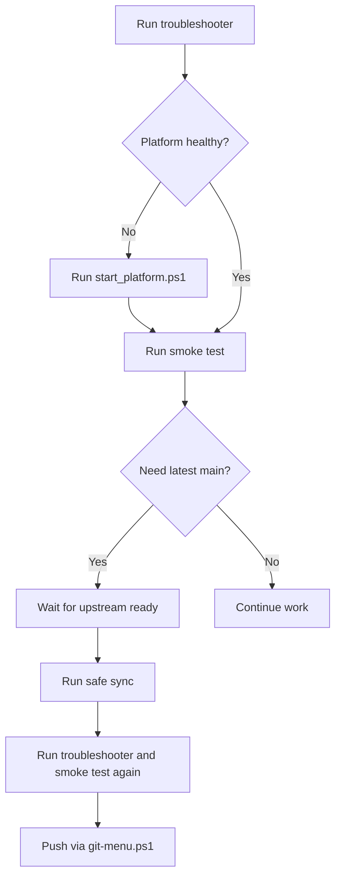

# New Developer Onboarding

This file is the shortest guided path for a new developer in this repo.

## Start Here

Read these in order:

1. `OPERATOR_CHEAT_SHEET.md`
2. `docs\FLOW_SHEETS.md`
3. `docs\SYSTEM_VISUAL_MAP.md`
4. `docs\GIT_VISUAL_MAP.md`
5. `docs\API_DB_VISUAL_MAP.md`

## First Mental Models

1. Git is only part of the system.
2. The local runtime matters as much as the code.
3. The database handoff path is separate from Git.
4. You should trust the scripts more than memory.

## First Commands To Learn

```powershell
.\scripts\troubleshoot_platform.ps1
.\scripts\start_platform.ps1 -EnsureOllama -OpenBrowser
.\scripts\troubleshoot_platform.ps1 -RunSmokeTest
.\scripts\sync_upstream_safe.ps1 -AutoCheckpoint
.\git-menu.ps1
```

## The Safe Beginner Workflow



## If You Feel Lost

Use this order:

1. `docs\FLOW_SHEETS.md`
2. `docs\SYSTEM_VISUAL_MAP.md`
3. `docs\GIT_VISUAL_MAP.md`
4. `docs\API_DB_VISUAL_MAP.md`
5. `scripts\troubleshoot_platform.ps1`