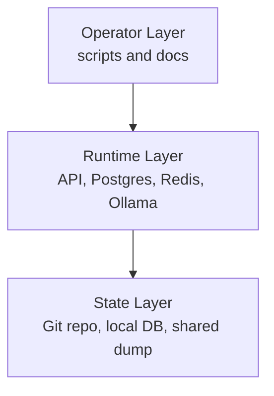
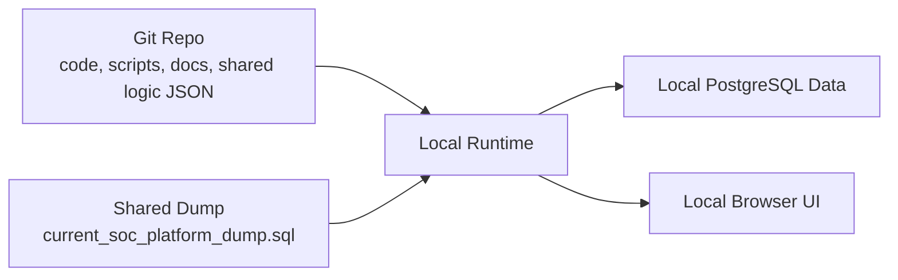
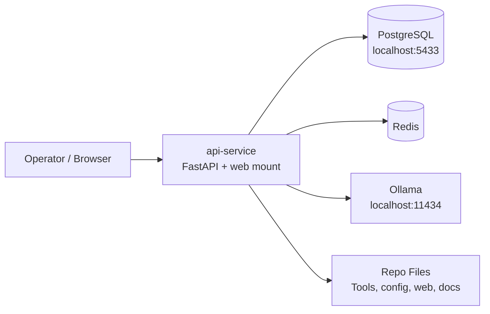
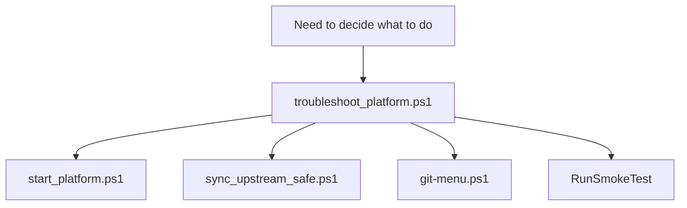
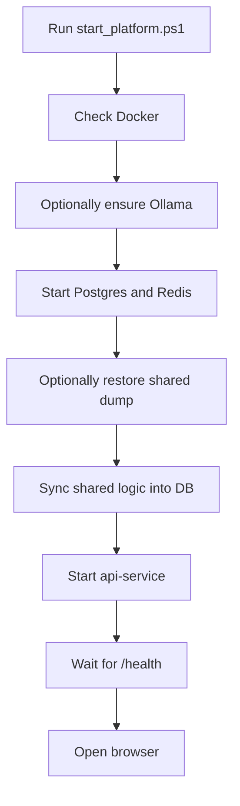
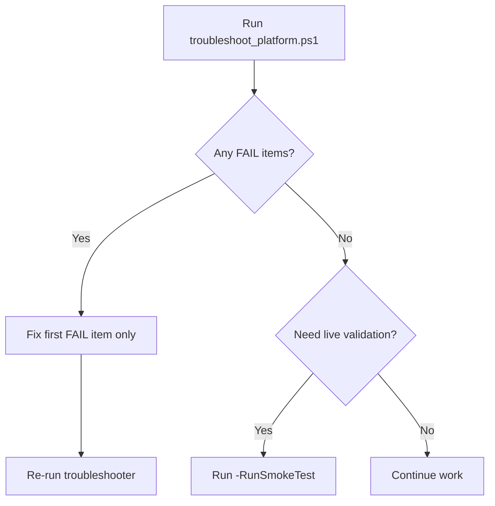
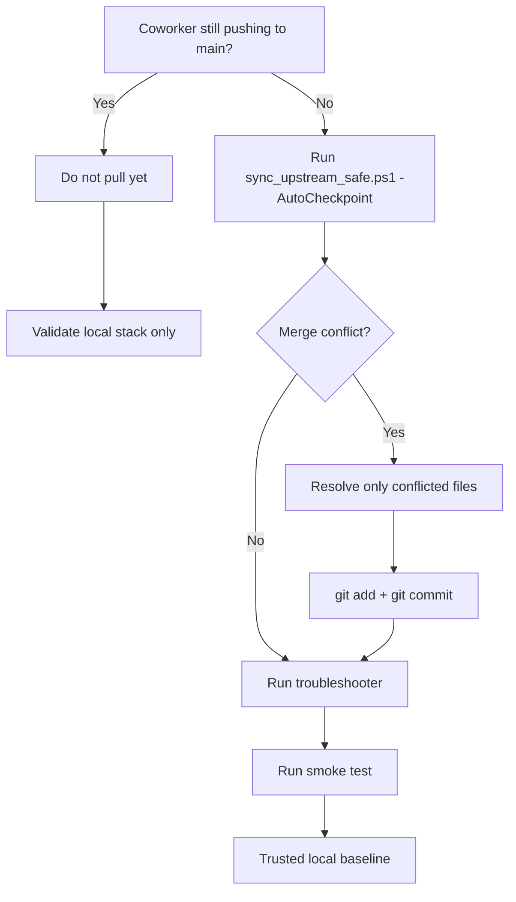
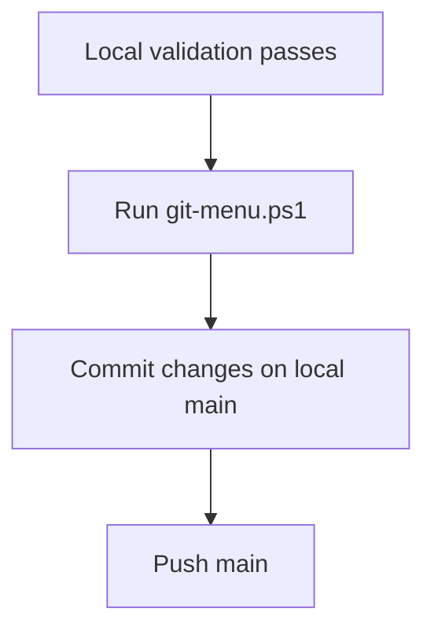

# SOC System Visual Map

This file is the high-level picture of the platform.

Use it when you need to answer these questions:

- What are the main moving pieces?
- What script should I think about first?
- What lives in Git versus the database versus the shared handoff dump?
- What happens when I start, sync, smoke test, or push?

## Mental Model 1: There Are Three Layers

Think about the system in three layers:

1. Operator layer
   The scripts and docs you run directly.
2. Runtime layer
   The live app and containers that do the work.
3. State layer
   The places where long-lived information lives.

## Mental Model 2: Git Is Not The Whole System

Git contains code and shared logic definitions.

Git does not contain the live case and alert database state.

## Runtime Architecture

This is the core runtime shape from `docker-compose.yml` and the FastAPI app.

## Where Things Live

### Control Surface

- `scripts\`
  Operational entry points
- `docs\`
  Human instructions and maps
- `git-menu.ps1`
  Safe branch-and-push helper

### App Surface

- `api\`
  FastAPI routes and orchestration endpoints
- `web\`
  Browser UI served by the API
- `services\`
  External service adapters like Ollama
- `db\`
  Database models and DB access

### Shared Logic And Tools

- `Commander_Registry.json`
  Tool registry
- `commander.py`
  CLI orchestrator
- `Tools\`
  Individual tool implementations

### State And Handoff

- local PostgreSQL container on `5433`
  Main local runtime database
- shared dump on `Z:`
  Team handoff state outside Git
- repo JSON and scripts
  Shared logic and automation definitions

## Operator Entry Points

Use these four commands as the main control panel.

### What Each One Means

- `scripts\troubleshoot_platform.ps1`
  First stop. Answers: what is broken, what is healthy, what command comes next.
- `scripts\start_platform.ps1`
  Starts the local runtime.
- `scripts\sync_upstream_safe.ps1`
  Safe pull with checkpoint behavior.
- `git-menu.ps1`
  Safe branch creation and push flow.
- `scripts\troubleshoot_platform.ps1 -RunSmokeTest`
  Validates the live workflow surface after startup or sync.

## Startup Flow

This is the normal "bring the platform up" path.

## Troubleshooting Flow

This is the normal "something feels wrong" path.

## Git And Team Sync Flow

This is the safe shared-development mental model.

## Push Flow

This is the safe "share my work" path.

## File Location Map

If you are asking "where would that probably be?", use this map.

| Question | Likely place |
| --- | --- |
| How do I start, stop, sync, or troubleshoot? | `scripts\` |
| What is the operator flow? | `docs\FLOW_SHEETS.md`, `docs\RESTART.md` |
| What is the system picture? | `docs\SYSTEM_VISUAL_MAP.md` |
| Where do API routes live? | `api\main.py` |
| Where does the browser UI live? | `web\` |
| Where do DB models live? | `db\` |
| Where do external service integrations live? | `services\` |
| Where are the tool implementations? | `Tools\` |
| Where is the CLI tool orchestrator? | `commander.py` |
| Where is the tool registry? | `Commander_Registry.json` |

## Recommended Reading Order

If you are building your mental model from scratch, read in this order:

1. `OPERATOR_CHEAT_SHEET.md`
2. `docs\FLOW_SHEETS.md`
3. `docs\SYSTEM_VISUAL_MAP.md`
4. `docs\RESTART.md`
5. `docs\CURRENT_OPERATING_MODEL.md`
6. `docs\REPO_MAP.md`